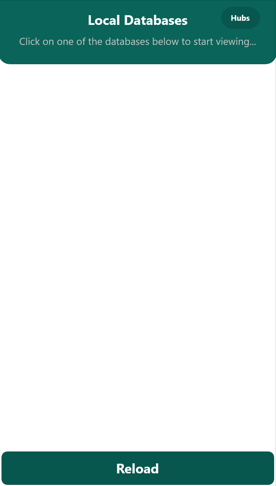
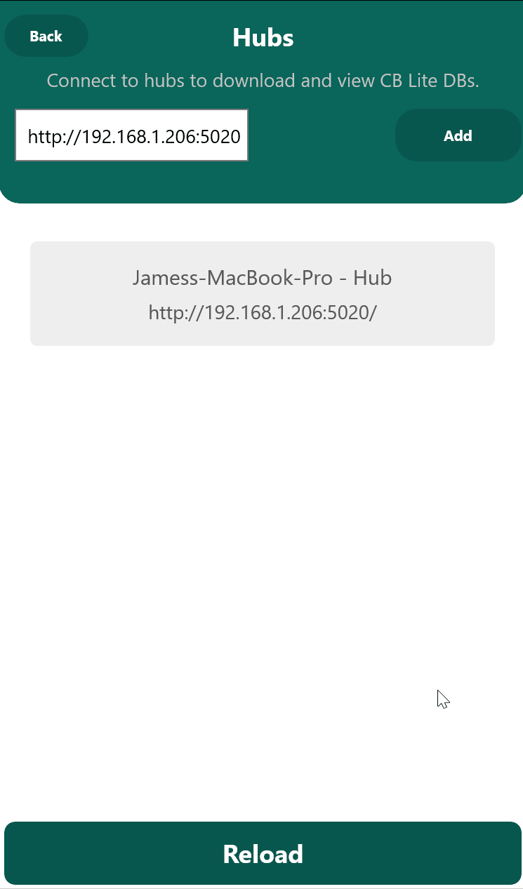
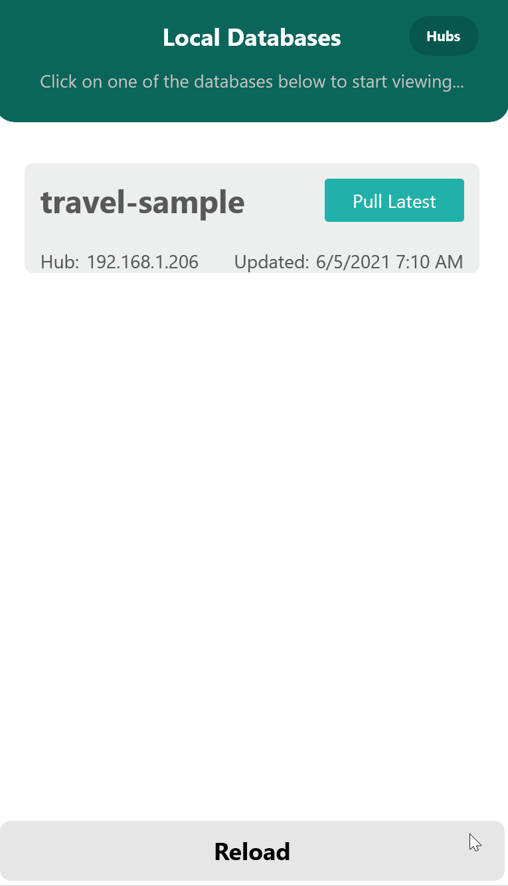

# Couchbase Lite Database Viewer

 
 

# Project Goal
The single aim of this project is to simplify sharing, viewing and editing Couchbase.Lite databases from any mobile device or desktop. 

Couchbase.Lite is not available on all platforms such as MacOS. This means that we can't open a Couchbase.Lite DB directly from a simulator. We can use the Hub as a proxy, though, and open the database on a platform that can open Couchbase.Lite databases.

 

# Project Roadmap
## Goals
- [x] Read Couchbase.Lite DBs
- [x] Provide Hub for receiving databases from remote systems
- [x] Add/Remove Edit Database Scanners from client
- [X] Allow update of database records 
- [X] Save documents / allow updating among all cached DBs
- [ ] Cache managment (Delete,Rename,Duplicate)
- [ ] Allow creation of new database
- [ ] Add Hub functionality to add/overrwrite database remotely
- [ ] Export All JSON
- [ ] Compare Docs in Database
- [ ] Create custom document viewers

## Client Platforms
- [x] Windows
- [x] Android
- [x] iOS
- [ ] Linux
- [ ] Mac (When .NET MAUI is a little more solid)

## Hub Platforms
- [x] Windows
- [x] Linux
- [x] Mac 
- [ ] Android
- [ ] iOS

 

# Components and Getting Started
## Hub
  The hub is the central point that apps can send their DBs to for other clients to share. They can also be used to scan the local machine for databases.  The hub is a super simple http server that serves the couchbase files.
  
  Platforms such as Linux and Mac are not able to open Couchbase.Lite databases at the time of this writing.  You can use the Hub to relay the files from a platform that does not support Couchbase.Lite to one that does.

  To find the Couchbase.Lite DB files, the Hub contains `Scanners` that search for the databases in different ways.  These are now setup client-side which will be covered in the client documentation.
 

## Client Viewer
  The client does the parsing and displaying of the documents within Couchbase.Lite databases. Windows desktop (UWP), Android and iOS are currently being supported.  You can also connect to Hubs to relay files around between platforms and open Couchbase.Lite DBs located on platforms that aren't supported.

Setting up Hubs is also now all done using the client after connecting.

# Setting up Hub
The Hub is setup using the client. All that needs to be done is to open the `DbViewer.Hub.sln` solution and start the Hub.
 

# Using the Client
When starting the app, you will be met with a blank screen since we have not yet added any Couchbase.Lite database. We will first need to connect to a Hub, set it up if we haven't yet, and then we can start downloading and viewing databases.

## Connect to Hub
This step assumes that you have a Hub running.  You will need to note the IP address of the computer running the Hub, or, if it is the same machine, you can just leave as `127.0.0.1`.

You will only need to do this once after install.

 

## Downloading Database
The Hub comes with a sample DB that we are going to download here. No additional setup is required to try this. Simply go to the Hub and click `Rescan All`, select the `travel-sample` and then `Download`.  

 
 

# Adding Database Locators
DbViewer has idea of a locator that allows for different database scenarios such as pointing to static directories or automatically finding iOS simulator folders using XCode.

## iOS Simulator Provider
The iOS DB Provider uses XCode to find the location of a particular simulator OR allows you to always scan the active `booted` simulator. You will just need to supply the bundle-id, simulatorid (or `booted`) and the relative path to the root app.

 
 

## Static Directory Locator
This simply points to a path that won't change. You only need to provide the path to the location of the Couchbase.Lite root directory.

